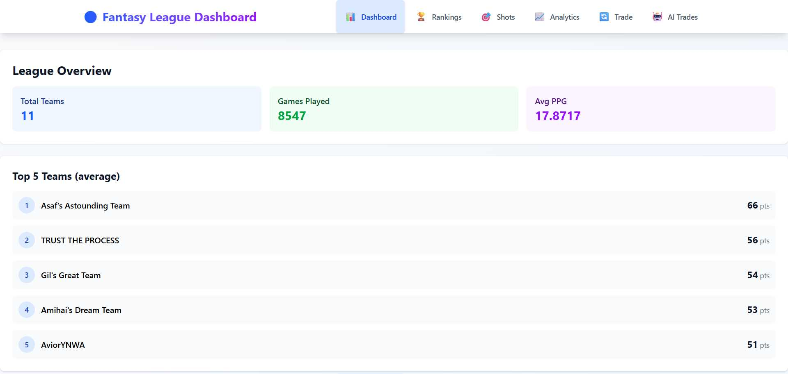
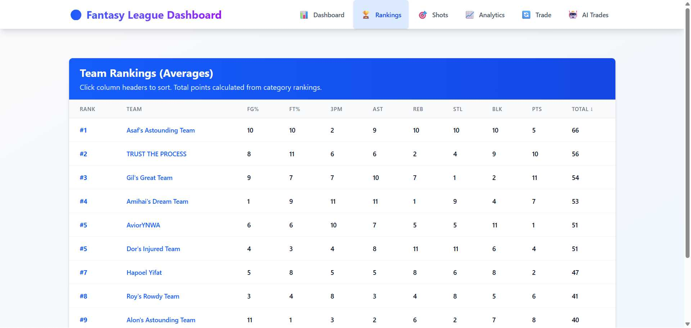
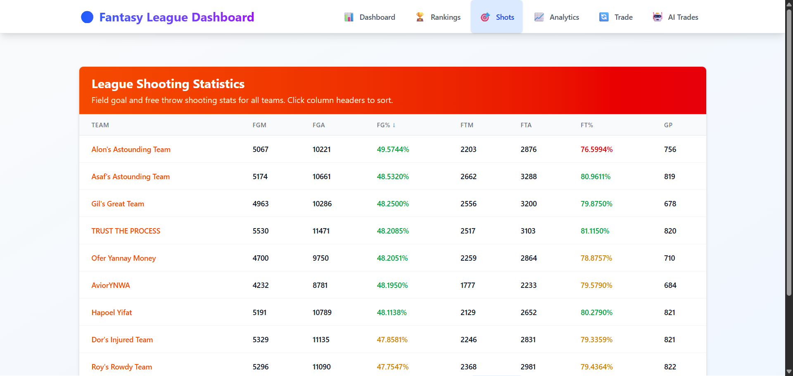
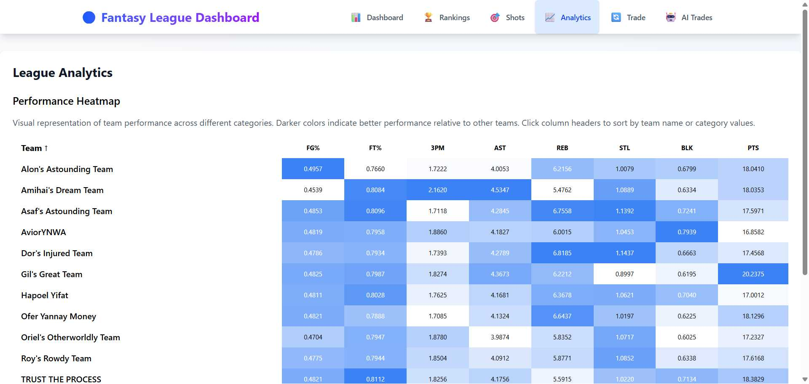
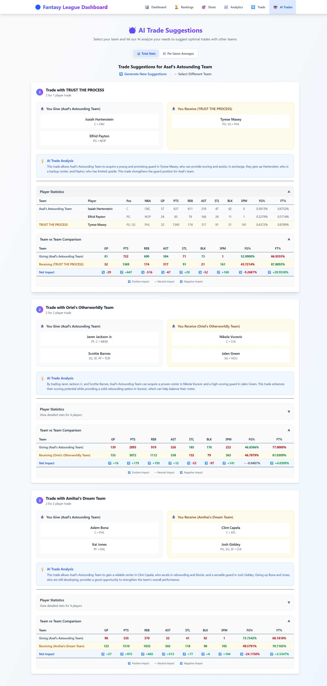
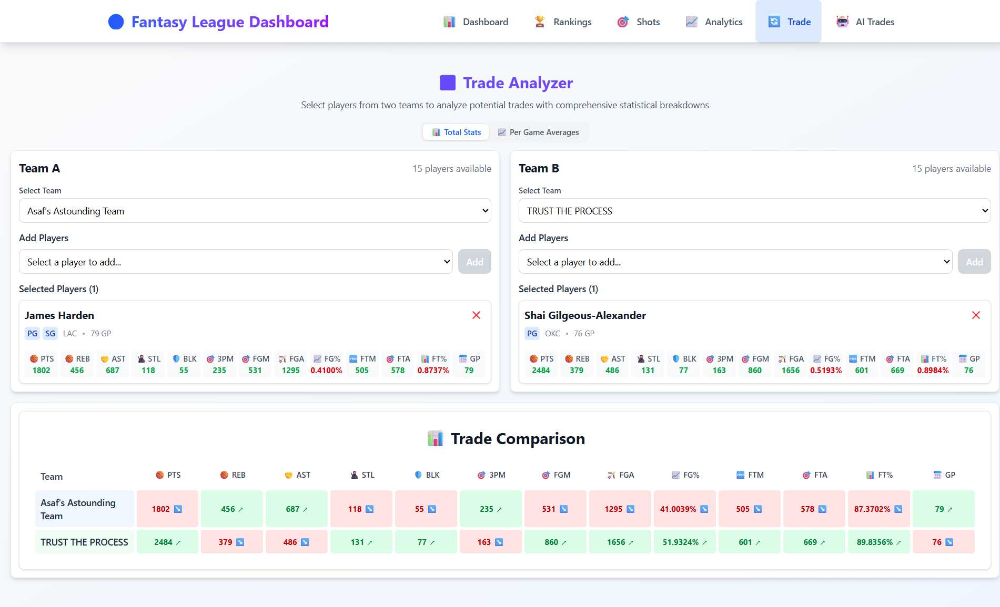

# Fantasy League Dashboard

A full-stack fantasy basketball application featuring AI-powered trade suggestions, real-time ESPN data integration, and comprehensive team analytics.

## 🏀 Features

- **Team Rankings**: Sortable rankings across all statistical categories
- **AI Trade Suggestions**: GPT-powered trade recommendations with impact analysis
- **Team Analytics**: Performance visualizations and detailed statistics
- **Player Data**: Comprehensive player statistics and roster management
- **Real-time Data**: Live ESPN Fantasy Basketball API integration

## 📸 Screenshots

### Dashboard Overview
Main dashboard showing league overview and top team rankings.



### Team Rankings
Comprehensive team rankings with sortable categories and statistical breakdowns.



### Shooting Statistics
League-wide shooting statistics with sortable field goal and free throw percentages.



### Analytics & Performance Heatmap  
Advanced analytics with color-coded performance indicators across all statistical categories.



### AI Trade Suggestions
Intelligent trade recommendations powered by GPT-4o-mini with detailed impact analysis and statistical comparisons.



### Manual Trade Analyzer
Interactive trade analysis tool for comparing players between teams with comprehensive statistical breakdowns.



## 🛠 Tech Stack

### Backend
- **Python 3.12+** - Programming language
- **FastAPI** - Python web framework
- **LangChain + OpenAI** - AI trade suggestions
- **pandas** - Data processing
- **pytest** - Testing
- **Docker** - Containerization

### Frontend
- **React 19** - Frontend framework
- **TypeScript** - Type safety
- **Redux Toolkit** - State management
- **TanStack Query (React Query)** - Server state management
- **Recharts** - Data visualization
- **Tailwind CSS** - Styling
- **Vite** - Build tool

## Setup

### Prerequisites
- Python 3.12+
- Node.js 18+
- uv (Python package manager)

### Installation

1. **Clone the repository**
   ```bash
   git clone <repository-url>
   cd fantasyAverageWeb
   ```

2. **Environment Setup**
   
   **Backend** - Create `.env` in `backend` directory:
   ```env
   ESPN_STANDINGS_URL=your_espn_standings_url
   ESPN_PLAYERS_URL=your_espn_players_url
   OPENAI_API_KEY=your_openai_api_key
   CORS_ORIGINS=localhost:5173,others
   ENVIRONMENT=production/development
   ```
   
   **Frontend** - Create `.env` in `frontend` directory:
   ```env
   VITE_API_BASE_URL=http://localhost:8000
   ```

3. **Backend Setup**
   ```bash
   cd backend
   uv sync
   ```

4. **Frontend Setup**
   ```bash
   cd frontend
   npm install
   ```

## 🚀 Running the Application

### Option 1: Backend Docker Setup
```bash
cd backend
docker-compose up --build
```
Backend: http://localhost:8000

*Note: Docker setup is currently available for backend only. Frontend runs locally.*

### Option 2: Local Development

**Backend:**
```bash
cd backend
uv run -m app.main
```

**Frontend:**
```bash
cd frontend
npm run dev
```

## 🧪 Testing

```bash
# Backend tests
cd backend
uv run pytest
```

## 📊 Data & AI

- **ESPN Fantasy API** - Live team and player statistics
- **OpenAI GPT-4o-mini** - AI-powered trade analysis
- **Smart Caching** - ETag-based HTTP caching for performance


## ⚙️ Environment Variables

### Backend
`.env` file in `backend/` directory:

```env
ESPN_STANDINGS_URL=your_espn_standings_url
ESPN_PLAYERS_URL=your_espn_players_url
OPENAI_API_KEY=your_openai_api_key
CORS_ORIGINS=localhost:5173,others
ENVIRONMENT=production/development
```

### Frontend
Optional `.env` file in `frontend/` directory:

```env
# API Configuration
VITE_API_BASE_URL=http://localhost:8000
```