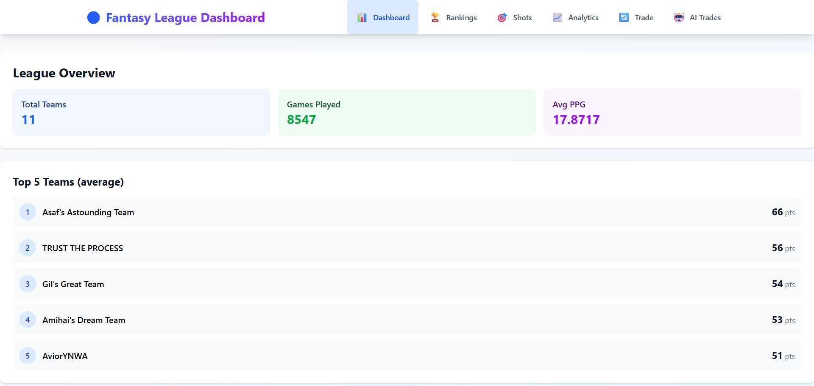
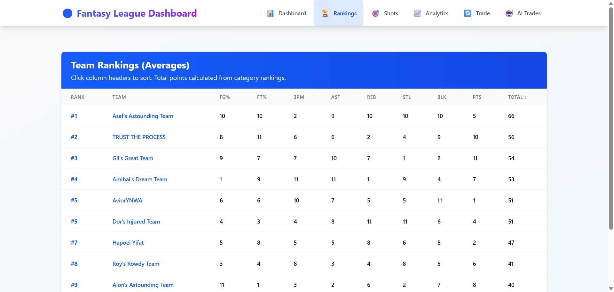
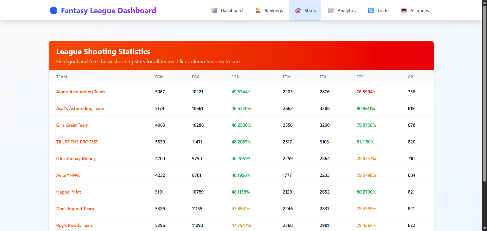
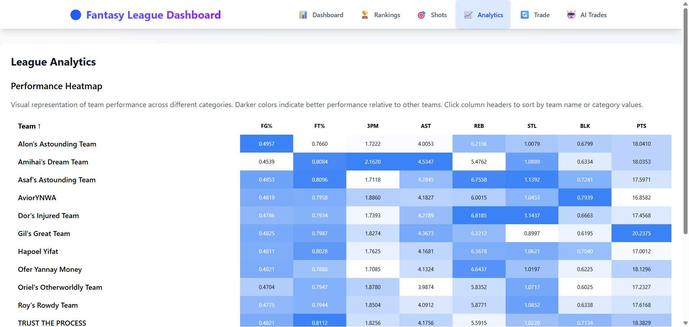
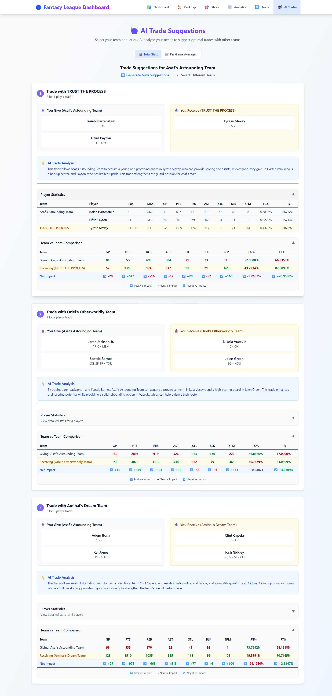
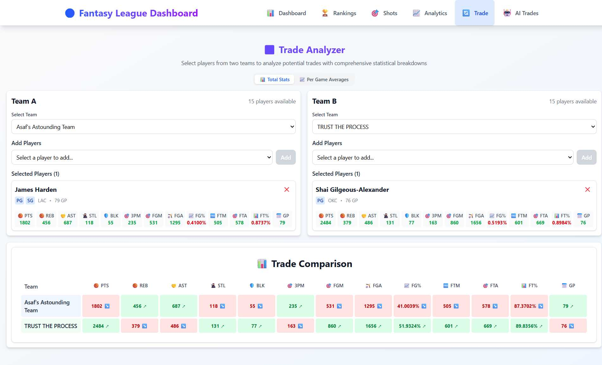

# Fantasy League Dashboard

Full-stack roto fantasy basketball app for a private ESPN league (12 teams, 8 categories).

Live: https://fantasyleagueinfo.onrender.com (Render free tier — cold starts after 15 min idle)

## Features

- **Dashboard** — league overview and top-team snapshot
- **Rankings** — sortable roto standings across all 8 categories
- **Shots** — league-wide FG%/FT% with sortable table
- **Analytics** — color-coded performance heatmap across all categories
- **Teams** — browse all fantasy teams with ESPN integration
- **Team Detail** — full roster, per-player stats, minutes tracking
- **Players** — all rostered players, free agents, and waivers with filters (position, status, stats thresholds)
- **Player Rankings** — custom z-score ranker: set category weights, filter by position/GP/MPG, sort by any column
- **Injuries** — live injury report from the official NBA injury-report PDF (polled every 15 minutes)
- **NBA Teams** — depth charts with client-side filters (hide injured, deduplicate positions)
- **Estimator** — Monte Carlo standings projection (runs on startup, background sync)
- **Trade Analyzer** — compare players between teams or vs free agents; z-score impact per category
- **Trade Suggestions** — AI trade recommendations with statistical impact analysis *(currently disabled — backend route removed)*

## Screenshots

### Dashboard Overview
Main dashboard showing league overview and top team rankings.



### Team Rankings
Comprehensive team rankings with sortable categories and statistical breakdowns.



### Shooting Statistics
League-wide shooting statistics with sortable field goal and free throw percentages.



### Analytics & Performance Heatmap
Advanced analytics with color-coded performance indicators across all statistical categories.



### AI Trade Suggestions
Intelligent trade recommendations with detailed impact analysis and statistical comparisons.



### Manual Trade Analyzer
Interactive trade analysis tool for comparing players between teams with comprehensive statistical breakdowns.



## Tech Stack

### Backend
- Python 3.12+ / FastAPI
- PostgreSQL (Neon) — persistent injury status, snapshots
- OpenAI (GPT-4o-mini) — trade suggestions (disabled for now)
- ESPN site API — game logs, schedule, rosters (defensive ranks/pace computed from our own store)
- pandas — data processing
- pytest — testing

### Frontend
- React 19 / TypeScript / Vite
- Redux Toolkit — global state
- TanStack Query — server state
- Recharts — visualizations
- Tailwind CSS — styling

## Setup

### Prerequisites
- Python 3.12+
- Node.js 18+
- uv (Python package manager)

### Installation

1. **Clone the repository**
   ```bash
   git clone <repository-url>
   cd fantasyAverageWeb
   ```

2. **Backend — create `backend/.env`**
   ```env
   SEASON_ID=your_season_id
   LEAGUE_ID=your_league_id
   OPENAI_API_KEY=your_openai_api_key
   DATABASE_URL=your_neon_postgres_url
   CORS_ORIGINS=localhost:5173
   ENVIRONMENT=development
   ```

3. **Frontend — create `frontend/.env`**
   ```env
   VITE_API_BASE_URL=http://localhost:8000
   ```

4. **Install dependencies**
   ```bash
   cd backend && uv sync
   cd ../frontend && npm install
   ```

### Running locally

**Backend:**
```bash
cd backend
uv run -m app.main
```

**Frontend:**
```bash
cd frontend
npm run dev
```

## Testing

```bash
cd backend
uv run pytest
```

## API Endpoints

Interactive docs at `/docs` when running locally.

### Rankings
- `GET /api/rankings` — league roto standings (`sort_by`, `order`)

### Teams
- `GET /api/teams` — all fantasy teams
- `GET /api/teams/{team_id}` — team stats, roster, shooting, rankings
- `GET /api/teams/{team_id}/players` — lightweight roster

### Players
- `GET /api/players` — all players with pagination (`page`, `limit`, up to 500)

### Player Rankings
- `GET /api/rankings/players` — z-score ranked player list

### League
- `GET /api/league/summary` — league overview
- `GET /api/league/shots` — shooting stats

### Analytics
- `GET /api/analytics/heatmap` — heatmap data

### Injuries
- `GET /api/injuries` — current injury report

### Estimator
- `GET /api/estimator/results` — latest Monte Carlo projection
- `POST /api/estimator/run` — trigger a fresh run

### NBA Teams
- `GET /api/nba-teams` — depth charts with injury status

### Trades
- `GET /api/trades/suggestions` — AI trade suggestions
- `POST /api/trades/analyze` — manual trade impact analysis
